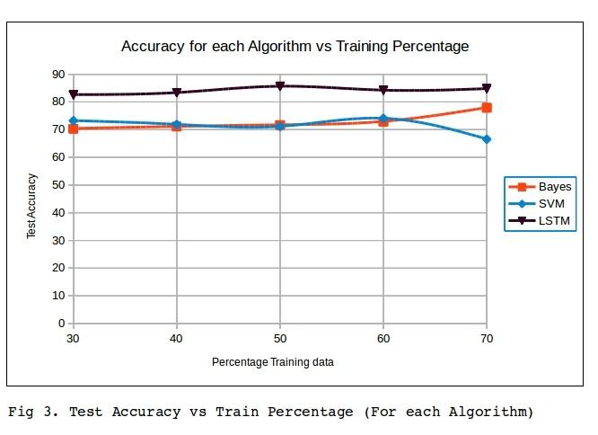

# **Election-2016 Tweet Classifier**

Twitter is a popular micro blogging service where users create status messages (called “tweets”). 
These tweets sometimes express opinions about different topics. With Presidential Election 2016 coming up there were vast amounts of tweets based on  it. This project aimed at creating a system to classify tweets into two categories i.e. “In favour of Hilary Clinton” or “In favour of Donald Trump”.

## **Data Gathering**

The main problem with data garthering in this project was finding data with labels. 
As tweets can be sarcastic, talking about both the parties involved and could contain different hashtags, it was not possible to get labels for any random tweet. So in order to get labeled data for training, we took five people each from campaigns of Hilary Clinton and Donald Trump, so that we can be sure of the labels of tweets from these Twitter accounts.

In oder to get tweets with labels “In favour of Trump”, these five people's accounts were selected and mined: realDonaldTrump, KellyannePolls, mike_pence, KatrinaPierson, DanScavino. Similarly to populate training data with labels for “In favour of Clinton”, these five people's accounts were selected and mined: HillaryClinton, benensonj, AmandaRenteria, johnpodesta, timkaine. A total of 27,610 tweets were mined from these accounts for training and testing purposes. For example following are a few tweet examples from the collected data:

In Favour of Clinton:
1. *“unfortunately for mike pence and donald trump, google exists (and we aren't stupid). https://t.co/dt15xthssr”*
2.  *“wonder if trump has shown pence his "secret plan" to defeat isis. we’re still waiting. vpdebate https://t.co/zxjpfcmzzf”*
3.  *“under hillary’s plan, if your family earns $125,000 or less, you'll be able to go to a public college tuition-free. https://t.co/psa3whyhxm”*

In Favour of Trump:
1. *“amazing rally in reno, nevada- thank you. make sure you get out on 11/8 andamp. vote trumppence16. together, we will put… https://t.co/6gpjhb29xk”*
2. *“small business says trump is their pick for president' https://t.co/tzvn9qgpfs”*
3. *“the constant interruptions last night by tim kaine should not have been allowed. mike pence won big!”*

## **Models**

Three models were used and contrasted:
1. Naive Bayes Classifier
2. Support Vector Machines
3. LSTM based Classifier

## **Results**

### **References**

1. [blog.twitter.com](https://blog.twitter.com/2015/guest-post-understanding-users-through-twitter-data-and-machine-learning)
2. [nltk](http://www.nltk.org/book/ch06.html)
3. [nltk - modules](http://www.nltk.org/_modules/nltk/classify/svm.html)
4. [csie.ntu.edu](http://www.csie.ntu.edu.tw/~cjlin/papers/guide/guide.pdf)
5. [Stanford cs224d- Deep Learning for NLP](http://cs224d.stanford.edu/syllabus.html)
6. [Keras](https://keras.io/layers/recurrent/)

